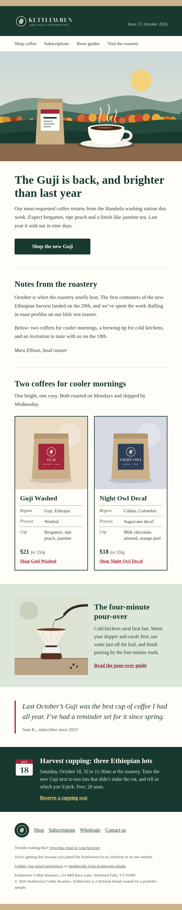
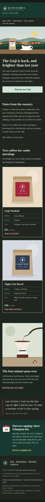

# Kettlewren Coffee Roasters: modular newsletter

A block-based HTML email system for a small-batch coffee roaster, plus one assembled monthly issue.

Kettlewren Coffee Roasters is a fictional brand created for a portfolio sample. Names, addresses and links (`*.example`) are invented.

| Light, 600px | Dark mode, 375px |
| --- | --- |
|  |  |

## Layout

```text
blocks/
  _layout.html            document shell: head, resets, dark mode styles, preheader, page wrapper
  01-header.html          logo bar with issue line, nav
  02-hero.html            full-width image, H1, intro, VML bulletproof button
  03-text.html            heading, body copy, sign-off
  04-product-cards.html   two-column product cards with origin details
  05-feature.html         image + copy, two columns, vertically centred
  06-testimonial.html     blockquote with attribution
  07-event-strip.html     dark strip with date icon and RSVP link
  08-footer.html          links, permission reminder, preferences, unsubscribe, postal address
issues/
  master.json             every block with default copy -> master.html
  2026-10-october.json    October issue: block order + copy edits -> newsletter-october.html
images/                   PNGs referenced relatively
scripts/
  build.mjs               assembles issues/*.json into root-level HTML
  check.mjs               static checks (see Testing)
  screenshots.mjs         headless Chromium renders into screenshots/
master.html               all blocks stacked
newsletter-october.html   finished October issue
```

## How the blocks work

Each block is a self-contained, 600px-max table wrapped in its own Outlook ghost table, so blocks can be stacked in any order inside the `{{BLOCKS}}` slot of `_layout.html` without shared wrappers. All presentational styles are inline; the `<style>` blocks in the head only hold resets, the mobile media query and dark mode overrides, so a client that strips `<style>` still gets a complete layout.

Multi-column blocks use the hybrid ("spongy") pattern: `display:inline-block` column wrappers capped with `max-width` sit side by side at 600px and wrap to a single column on narrow screens without any media query. Outlook on Windows gets fixed-width cells from MSO conditional tables. The media query is an enhancement only: it widens stacked columns to full width, tightens gutters and makes the hero button full width.

## Assembling an issue

With Node 22+:

```sh
npm run build
```

`build.mjs` reads every file in `issues/`, concatenates the listed blocks into the layout and applies that issue's copy edits. Edits are literal find/replace pairs scoped to one block; a pair that no longer matches fails the build, so a block change can't silently drop issue copy.

To build by hand, paste the blocks you want, in order, between the page wrapper's `<td>` tags in `_layout.html`, then replace `{{TITLE}}`, `{{PREHEADER}}` and `{{ISSUE}}`.

Before sending, host `images/` on your ESP or CDN and replace the relative `src` paths with absolute URLs.

## Platform notes

Merge tags in the source use Mailchimp syntax.

| Purpose | Mailchimp | Klaviyo |
| --- | --- | --- |
| View in browser | `*\|ARCHIVE\|*` | `` |
| Unsubscribe | `*\|UNSUB\|*` | `` |
| Preferences | `*\|UPDATE_PROFILE\|*` | `` |
| Postal address | `*\|LIST:ADDRESSLINE\|*` | `{{ organization.full_address }}` |
| First name with fallback | `*\|IF:FNAME\|**\|FNAME\|**\|ELSE:\|*there*\|END:IF\|*` | `{{ first_name\|default:'there' }}` |

The footer prints the address as literal text so previews read correctly; swap it for the address tag if the list's address should come from the ESP.

- Mailchimp: to make blocks editable in the campaign builder, add `mc:edit="hero_title"` style attributes to text elements and `mc:repeatable="content"` to a block's outer table. Mailchimp inlines CSS by default; leave that on, it won't touch the existing inline styles.
- Klaviyo: import `newsletter-october.html` as a custom HTML template, or save each block as a universal content block. After import, confirm the head `<style>` blocks survived the editor; the layout works without them, but dark mode and the mobile tweaks don't.
- Gmail clips messages over 102 KB. Built files are about 28 KB, leaving room for ESP tracking links.

## Client support

- Outlook 2016-365 on Windows: ghost tables, VML `v:roundrect` button, `OfficeDocumentSettings` with `PixelsPerInch` 96 for correct image scaling at high DPI, `mso-line-height-rule: exactly`.
- Dark mode: `color-scheme` / `supported-color-schemes` meta and `:root` declaration, `prefers-color-scheme` overrides (Apple Mail, iOS Mail, Outlook for Mac), and `[data-ogsc]` / `[data-ogsb]` overrides for Outlook.com. The three `<style>` blocks are separate so a client that rejects one keeps the others.
- Forced inversion (Gmail apps, Outlook for Windows dark mode): every text colour sits on a background it was designed against, the logo has its background baked in, and no copy is set on the mid-tone page colour, so inverted output stays legible.
- Accessibility: `lang` on `<html>` and the article wrapper, `role="presentation"` on layout tables, one H1 and ordered H2/H3, a real `<blockquote>`, descriptive alt text (empty alt on decorative icons), link text that names its destination, preheader hidden with `mso-hide:all`.
- Images: every `` has `alt`, `width`, `height`, `border="0"` and `display:block`, and styled alt text so the layout holds with images off.

## Testing

```sh
npm run screenshots   # requires Chromium; set CHROME_PATH if it isn't on PATH
npm run check
```

`check.mjs` fails on: size at or above 102 KB, missing `lang`/`title`/PixelsPerInch/color-scheme meta, external CSS or scripts, unbalanced tags or conditional comments, layout tables without `role="presentation"`, structural `<div>`s, images missing `alt`/`width`/`border`/`display:block` or a file on disk, and vague link text.

Screenshots in `screenshots/` are Chromium renders at 600px and 375px in light, `prefers-color-scheme: dark`, and a forced-dark approximation. They are not a substitute for a pass in Litmus or Email on Acid; Outlook's Word engine in particular has only been checked against the markup, not rendered.

Typefaces: headings use Rockwell (macOS, Windows with Office) falling back to Century Schoolbook and Georgia; body copy is Georgia. The screenshots were rendered on Linux, where the fallbacks are C059 and Liberation Serif.
